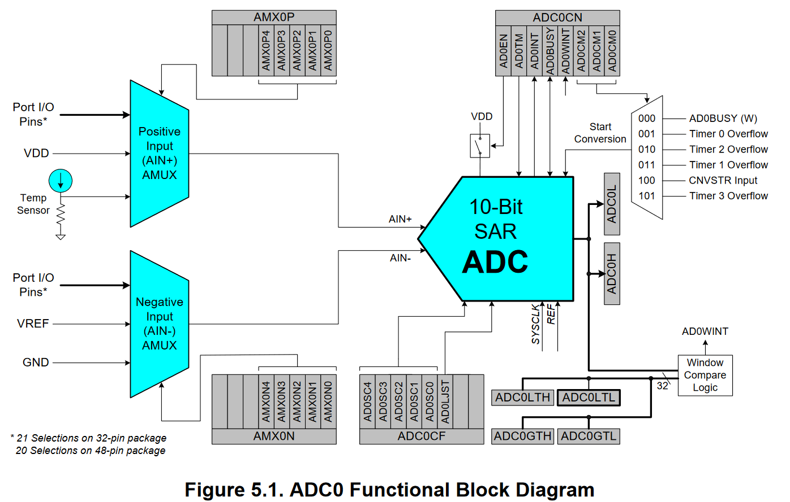

# ADC-C8051F340

Used data sheet for [IC C8051F340](https://www.silabs.com/documents/public/data-sheets/C8051F34x.pdf) 
We want to adc from 0v-5v to a 10bit binary number

[ADC_Try.c](ADC_Try.c) should work if you put your potentiometer to P1.0
and your reference voltage to Vref!

# Summary of the 10 bit ADC

Just to gain an oversight of what is going on

* 2x AMUX
* Uses successive approximation
* Integrated [Track/Sample and Hold](https://en.wikipedia.org/wiki/Sample_and_hold)
   * Locks analog signal for a time x
* [Window detector](https://en.wikipedia.org/wiki/Window_detector) (programmable)
   * Checks if an input is between 2 refrence threshold voltages
* `AMX0N` Registrys for negative input AMUX (0 to 4 regs -> 5bit)
   * Properties for negative AMUX
   * See SFR Definition 5.2
* `AMX0P` Registrys for positive input AMUX (0 to 4 regs -> 5bit)
   * Properties for positive AMUX
   * See SFR Definition 5.1
* `ADC0CN` ADC Config register
* `ADC0H/L` Output high + low
   * order changable through `AD0LJST` (left/right justification)
* `AD0BUSY` trigger
* `AD0INT` 1 after conversation finsish
* Should auto use Vref as reference volatage
   * `REFSL` is set to 0 in `REF0CN` see [Reference Control](https://www.silabs.com/documents/public/data-sheets/C8051F34x.pdf#G8.1026910)

# Thoughts

* Leave `AMX0P/N` at the reset value of 0 and take P1.0 (e.g. Pin 46) for input
   * Don't want to use the mux bc I only have one value e.g. one pin
* ~~Probably need to use the Digital I/O parts to get the values to the LED~~
* I just found the [C8051F340.h](C8051F340.h) which is the default lib for the SFR definitions [Source](https://github.com/darconeous/sdcc/blob/master/device/include/mcs51/C8051F340.h)
* `The ADC0 subsystem is enabled only when the AD0EN bit in the ADC0 Control register (ADC0CN) is set to logic 1` So to enable the ADC I have to set AD0EN (ADC0CN) to 1
   * `ADC0CN |= 0x80 // or 128 which is both 1000 0000 bc ADC0CN is 8bit and AD0EN is the highest bit`
* For the negative input we take the GND for Single-end mode
   * Not sure but I think single ended is the mode here
   * bc `REF` should be the reference voltage ?!
   * `AMX0N` needs to be configured to `‭0x1F‬` or `31`
      * Config of GND is 0001 1111
* Output after conversion `ADC0H` - `ADC0L`
   * Left/Right order justification!
   * needs to go to P0 and P3
      * `ADC0H` -> P0.1, P0.0 // High 2 bits
      * `ADC0L` -> P3.7..P3.0 // Low 8 bits
* We need to constantly trigger the ADC
   * Use a loop here
   * use the `AD0BUSY` to trigger conversation
   * wait on `AD0INT` (is 1 after conversion completion)
* Keep `AD0CM0-2` 000 to use `AD0BUSY`
* Push `ADC0H` - `ADC0L` forward to P0.1, P0.0 and P3.7..P3.0
# Block diagram

# Pin config

