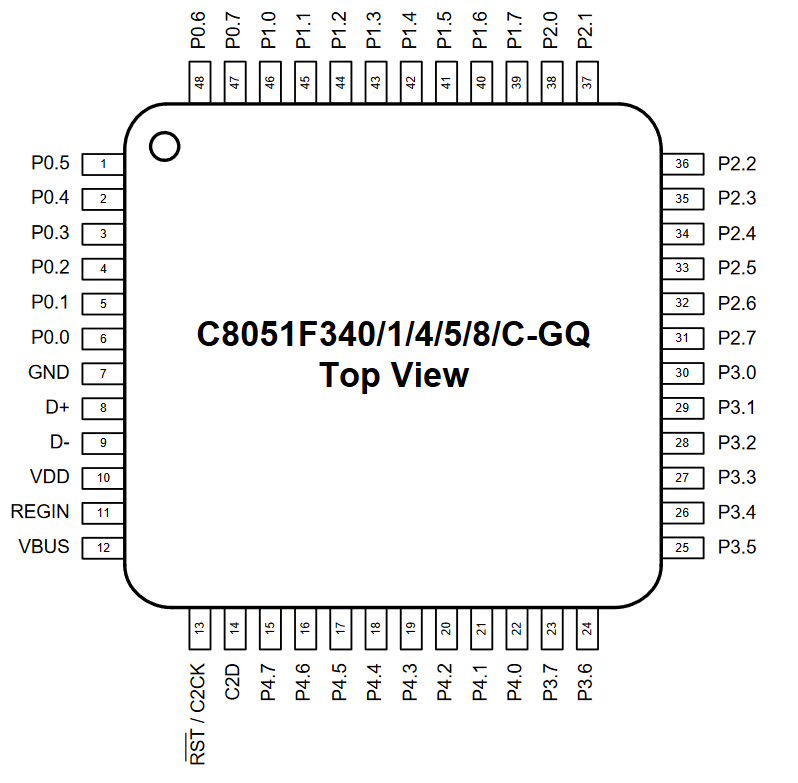

# ADC-C8051F340

Used data sheet for [IC C8051F340](https://www.silabs.com/documents/public/data-sheets/C8051F34x.pdf) 
We want to adc from 0v-5v to a 10bit binary number

# Summary of the 10 bit ADC

Just to gain an oversight of what is going on

* 2x AMUX
* Uses successive approximation
* Integrated [Track/Sample and Hold](https://en.wikipedia.org/wiki/Sample_and_hold)
   * Locks analog signal for a time x
* [Window detector](https://en.wikipedia.org/wiki/Window_detector) (programmable)
   * Checks if an input is between 2 refrence threshold voltages
* AMX0N Registrys for negative input AMUX (0 to 4 regs -> 5bit)
   * Properties for negative AMUX
   * See SFR Definition 5.2
* AMX0P Registrys for positive input AMUX (0 to 4 regs -> 5bit)
   * Properties for positive AMUX
   * See SFR Definition 5.1

# Thoughts

* Leave AMX0P/N at the reset value of 0 and take P1.0 (e.g. Pin 46) for input
   * Don't want to use the mux bc I only have one value e.g. one pin
* Probably need to use the Digital I/O parts to get the values to the LED
* I just found the [C8051F340.h](C8051F340.h) which is the default lib for the SFR [Source](https://github.com/darconeous/sdcc/blob/master/device/include/mcs51/C8051F340.h)definitions

# Pin config

